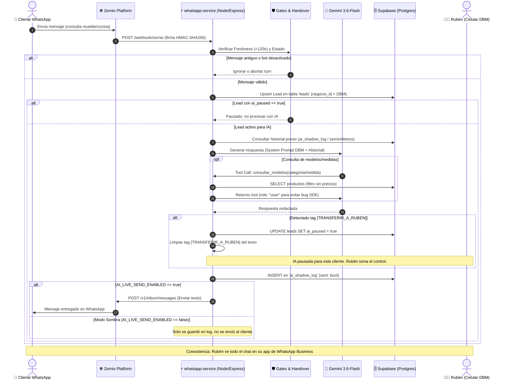

# Misión Control — Diagramas y Arquitectura del Sistema
**Versión:** 2.0 (Post-Multitenancy y Asistente IA)  
**Última actualización:** 19/09/2026

---

## 1. Flujo End-to-End del Agente de WhatsApp (Zernio + Gemini + Handover)

Este diagrama refleja la arquitectura operativa real del canal de WhatsApp de DBM (+54 9 11 3644-9059) con modo Coexistencia.



---

## 2. Arquitectura Multi-Tenant y Seguridad RLS (Row Level Security)

Este diagrama detalla cómo conviven De Buena Madera (negocio ancla) y las futuras mueblerías sin fuga de datos.

```mermaid
graph TD
    subgraph Usuarios y Sesiones
        U1["c.tecnozone@gmail.com<br/>(role: super_admin)"]
        U2["empleado@debuenamadera.com<br/>(role: user, negocio: DBM)"]
        U3["cliente_nuevo@muebleriaX.com<br/>(role: admin, negocio: Mueblería X)"]
    end

    subgraph Capa Frontend / Cliente
        ClientSSR["lib/supabase-browser.ts<br/>(@supabase/ssr - Cookies de Sesión)"]
        ClientServer["lib/supabase-server.ts<br/>(Server Components & /asistente)"]
        ClientAdmin["lib/supabase-admin.ts<br/>(Service-Role Key - Solo Rutas API)"]
    end

    subgraph Base de Datos Supabase (PostgreSQL)
        T_Negocios[("Tabla: negocios<br/>- DBM (UUID fijo)<br/>- Mueblería X (UUID 2)")]
        T_Profiles[("Tabla: profiles<br/>- id, email, role, negocio_id")]
        
        subgraph Tablas Protegidas por RLS
            T_Ventas[("ventas")]
            T_Leads[("leads")]
            T_Gastos[("gastos")]
            T_Productos[("productos")]
            T_Stock[("control_stock")]
            T_Compras[("compras")]
        end
    end

    U1 --> ClientSSR
    U2 --> ClientSSR
    U3 --> ClientSSR

    ClientSSR --> T_Profiles
    ClientServer --> T_Profiles

    subgraph Políticas RLS (negocio_scope)
        P1["USING (negocio_id = mi_negocio_id() OR es_super_admin())"]
    end

    T_Profiles --> P1
    P1 --> T_Ventas
    P1 --> T_Leads
    P1 --> T_Gastos
    P1 --> T_Productos
    P1 --> T_Stock
    P1 --> T_Compras

    ClientAdmin -.->|Bypassa RLS para Webhooks & Admin| T_Negocios
    ClientAdmin -.->|Bypassa RLS| T_Leads
```

---

## 3. Matriz de Componentes del Sistema

| Módulo | Fuente de Datos / Cliente | Seguridad / Scope | Observaciones |
| :--- | :--- | :--- | :--- |
| **Dashboard** | `lib/supabase-browser.ts` | RLS (`negocio_scope`) | KPIs anuales y mensuales en tiempo real. |
| **Navbar & Sidebar** | `lib/supabase-browser.ts` | Frontend check role | Permite botón Admin para `admin` y `super_admin`. |
| **Panel Admin (`/admin`)**| `app/api/admin/users` + service-role | `ADMIN_EMAIL` match | Gestión de tenants, altas de mueblerías y planes. |
| **Leads CRM** | `lib/supabase-browser.ts` | RLS (`negocio_scope`) | Tablero Kanban con flags `ai_paused` y canal. |
| **Asistente IA (`/asistente`)** | `lib/supabase-server.ts` + Gemini | RLS heredada | 5 tools de solo lectura, normalizador de meses. |
| **WhatsApp Service** | Local / Vercel + Service-Role | `NEGOCIO_ID_DBM` explícito | Conector Zernio, webhook firmado y shadow log. |
| **Catálogos Públicos** | Anon Key (`lib/supabase.ts`) | Política `catalogo_publico` | Abiertos al público sin necesidad de login. |
